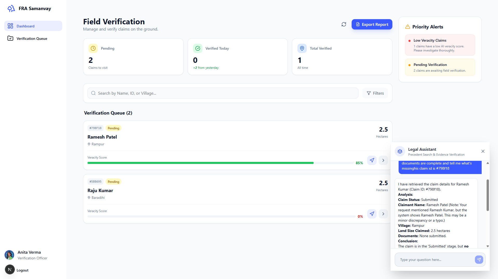
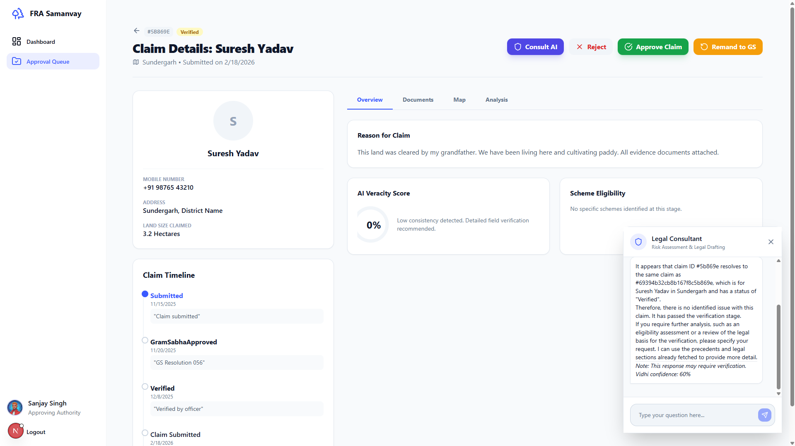
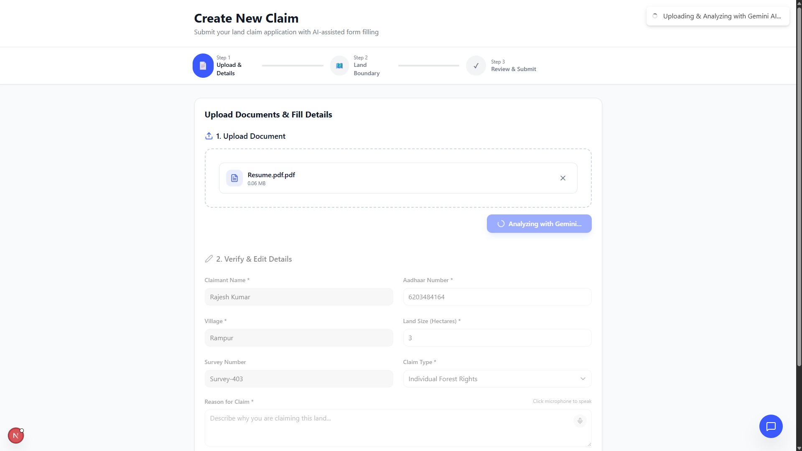
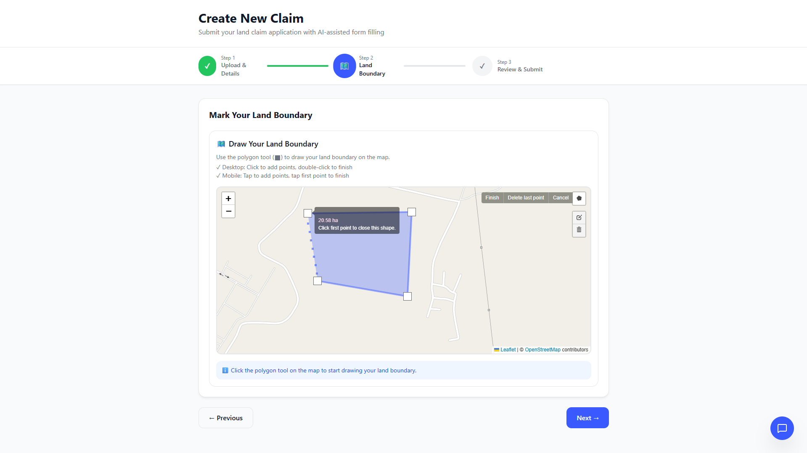
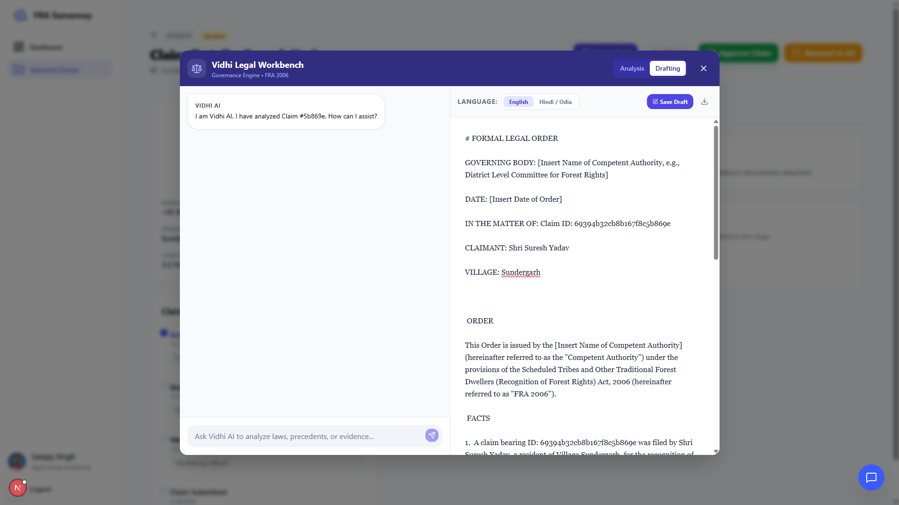
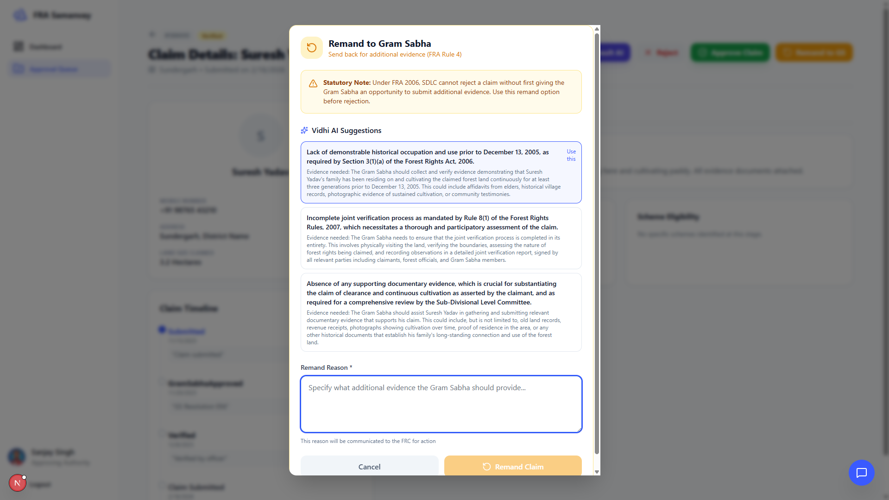

<div align="center">

# FRA Samanvay

**AI-powered Forest Rights Act digitization platform with agentic AI, RAG-based legal search, and geospatial verification**

[](https://fra-samanvaya.vercel.app)
[](LICENSE)

**Built for Smart India Hackathon 2025** · **9 User Roles** · **3 AI Agents** · **13 Backend Services** · **Deployed & Live**

</div>

---

## The Problem

India's Forest Rights Act 2006 gives millions of tribals legal rights to their ancestral land. But the claim process is entirely paper-based — data entry officers retype scanned documents, field workers can't prove site visits, and citizens have zero visibility into where their claim is stuck. We built this to digitize the entire pipeline — from claim submission to title deed generation — with AI doing the heavy lifting at every step.

---

## What Makes This Different

This isn't a CRUD app with a chatbot bolted on. Every role gets a unique dashboard with specialized AI tools:

| What | How |
|------|-----|
| **3 AI Agents** with autonomous tool use | Mitra (service), Satark (vigilance + vision), Vidhi (legal reasoning with self-correction) |
| **RAG with Hybrid Search** | Vector + keyword search combined via Reciprocal Rank Fusion (RRF) |
| **Geospatial verification** | Turf.js polygon math — overlap detection, area calculation, point-in-polygon GPS checks |
| **Legal state machine** | 10-state workflow enforcing FRA 2006 statutory requirements (Gram Sabha → Joint Verification → SDLC → Title Deed) |
| **3-tier document pipeline** | Sharp normalization → SHA-256 dedup → Gemini OCR with per-field confidence scoring |
| **Vision AI evidence matching** | Gemini 2.0 Flash compares site photos against satellite imagery |
| **Bilingual legal drafting** | AI drafts formal orders in English + Hindi/Odia, editable in a live canvas |
| **Form C Title Deed PDF** | Auto-generated legal title deed per FRA Rules 2008 via Puppeteer |

---

## Screenshots

| Verification Dashboard + AI Chat | Claim Detail + Legal Consultant | AI-Powered OCR Auto-Fill |
|:-:|:-:|:-:|
|  |  |  |

| GIS Map — Polygon Boundary Drawing | Vidhi Legal Workbench — Order Drafting | AI-Suggested Remand (FRA Rule 4) |
|:-:|:-:|:-:|
|  |  |  |

---

## Architecture

```
┌─────────────────────────────────────────────────────────────────┐
│                    FRONTEND (Next.js 16 + React 19)             │
│  ┌──────────┐ ┌────────────────┐ ┌──────────┐ ┌─────────────┐  │
│  │ Login    │ │ 8 Role-Based   │ │ Claim    │ │ Smart OCR   │  │
│  │ + 2FA    │ │ Dashboards     │ │ Detail   │ │ Upload +    │  │
│  │          │ │ (~146 KB)      │ │ (978 ln) │ │ Voice Input │  │
│  └──────────┘ └────────────────┘ └──────────┘ └─────────────┘  │
│  ┌──────────────────────┐  ┌────────────────────────────────┐  │
│  │ Legal Workbench      │  │ Atlas Map (Leaflet + GeoJSON)  │  │
│  │ Canvas Editor        │  │ Polygon Drawing + Area Calc    │  │
│  └──────────────────────┘  └────────────────────────────────┘  │
└──────────────────────────────┬──────────────────────────────────┘
                               │
                               ▼
┌─────────────────────────────────────────────────────────────────┐
│                     TRINITY AI ENGINE                           │
│  ┌─────────────────┐ ┌──────────────────┐ ┌─────────────────┐  │
│  │ 🤝 MITRA        │ │ 🛡️ SATARK        │ │ ⚖️ VIDHI        │  │
│  │ Service Agent   │ │ Vigilance Agent  │ │ Governance Agent│  │
│  │ ─────────────── │ │ ──────────────── │ │ ─────────────── │  │
│  │ • Citizen chat  │ │ • Vision AI      │ │ • Legal RAG     │  │
│  │ • Form autofill│ │ • Satellite vs   │ │ • Precedent     │  │
│  │ • Scheme search│ │   site photo     │ │   search        │  │
│  │ • Status lookup│ │ • Turf.js geo    │ │ • Order draft   │  │
│  │                │ │ • GPS verify     │ │ • Self-correct  │  │
│  └─────────────────┘ └──────────────────┘ └─────────────────┘  │
└──────────────────────────────┬──────────────────────────────────┘
                               │
                               ▼
┌─────────────────────────────────────────────────────────────────┐
│                     13 BACKEND SERVICES                         │
│  ┌──────────────────┐ ┌──────────────────┐ ┌────────────────┐  │
│  │ Document         │ │ RAG Service      │ │ Risk Engine    │  │
│  │ Processor        │ │ Hybrid Search    │ │ Rules + AI     │  │
│  │ Sharp→SHA→OCR    │ │ Vector + RRF     │ │ Scoring        │  │
│  ├──────────────────┤ ├──────────────────┤ ├────────────────┤  │
│  │ Conflict         │ │ Anomaly          │ │ PDF Generator  │  │
│  │ Detector         │ │ Detector         │ │ Form C Title   │  │
│  │ Geo Overlap      │ │ Fraud Patterns   │ │ Deeds          │  │
│  ├──────────────────┤ ├──────────────────┤ ├────────────────┤  │
│  │ Notification     │ │ Policy Matcher   │ │ Satark Tools   │  │
│  │ Email + SMS      │ │ DA-JGUA Schemes  │ │ Turf.js Verify │  │
│  └──────────────────┘ └──────────────────┘ └────────────────┘  │
└──────────────────────────────┬──────────────────────────────────┘
                               │
                               ▼
┌─────────────────────────────────────────────────────────────────┐
│                        DATA LAYER                               │
│  ┌──────────────────────────┐  ┌────────────────────────────┐  │
│  │ MongoDB Atlas            │  │ Knowledge Base             │  │
│  │ Vector Search (768-dim)  │  │ FRA 2006 Laws + Schemes    │  │
│  │ 8 Models + Embeddings    │  │ Ingested for RAG           │  │
│  └──────────────────────────┘  └────────────────────────────┘  │
└─────────────────────────────────────────────────────────────────┘
```

---

## The Trinity AI Engine

<details>
<summary><b>🤝 Mitra — Service Agent</b> (click to expand)</summary>

**Who uses it:** Citizens, Data Entry Officers, NGO Viewers

Mitra adapts its persona based on who's logged in:
- **Citizen mode:** Explains claim status in simple language, searches government schemes, translates status updates
- **Data Entry mode:** Validates claim data, assists with OCR form-fill, checks for missing fields
- **NGO mode:** Provides regional statistics, generates impact reports

**Technical details:**
- Uses Gemini 2.5 Flash for fast responses
- Role-specific tool sets (citizens get `search_schemes` + `lookup_claim_status`, data entry gets `validate_claim` + `extract_claim_data`)
- Function calling — the agent autonomously decides which tools to invoke based on user queries
- Persistent chat history stored in MongoDB

</details>

<details>
<summary><b>🛡️ Satark — Vigilance Agent</b> (click to expand)</summary>

**Who uses it:** Field Workers, Verification Officers

Satark is the fraud detection and evidence verification agent:
- **Vision AI:** Compares uploaded site photos against satellite snapshots using Gemini 2.0 Flash Vision — generates a match score and detailed analysis
- **Geospatial math:** Uses Turf.js for precise polygon operations:
  - `calculateGeospatialOverlap()` — exact overlap percentage between claim polygon and protected areas
  - `verifyCoordinates()` — point-in-polygon check for GPS verification
  - `calculateClaimArea()` — precise area computation in hectares
- **Full verification pipeline:** Combines vision analysis + geometric analysis into a single recommendation (Approve/Reject/NeedsReview)

**Role-specific behavior:**
- Verification Officers get a professional analytical persona
- Field Workers get step-by-step guidance for site visits
- Approving Authorities get a risk-focused assessment view

</details>

<details>
<summary><b>⚖️ Vidhi — Governance Agent</b> (click to expand)</summary>

**Who uses it:** Approving Authorities, Scheme Admins

Vidhi is the legal reasoning agent with **self-correction**:
- **RAG-powered:** Searches the FRA 2006 knowledge base using hybrid search (vector + keyword with Reciprocal Rank Fusion)
- **Precedent search:** Finds similar past claims via MongoDB Atlas Vector Search on 768-dimensional embeddings
- **Legal order drafting:** Generates formal orders in English + Hindi/Odia, citing FRA 2006 sections
- **Self-correction loop:** After generating a response, Vidhi evaluates its own output for accuracy and completeness — if confidence is below threshold, it regenerates with corrections
- **Live canvas editing:** Drafted orders open in an editable canvas where officers can modify before finalizing

**Technical details:**
- Uses Gemini 2.5 Pro for deep legal reasoning
- Tool calling: `search_precedents`, `fetch_laws`, `draft_order`
- Each tool declaration includes schema definitions for structured function calling

</details>

---

## Role-Based Access

<details>
<summary><b>9 distinct roles, each with unique dashboards and features</b> (click to expand)</summary>

| Role | Dashboard Size | Key Features |
|------|---------------|--------------|
| **Citizen** | 11.4 KB | Submit claims, track status, upload documents, AI scheme recommendations, voice input |
| **Data Entry Officer** | 25.3 KB | Digitize paper claims, AI-assisted OCR form-fill, batch processing, validation |
| **Field Worker** | 19.1 KB | GPS-tagged site visits, photo upload, satellite comparison, offline sync simulation |
| **Verification Officer** | 21.7 KB | Evidence review, side-by-side AI analysis panel, split-screen verification workflow |
| **Approving Authority** | 19.7 KB | Final decisions, Legal Workbench with live order drafting, risk analysis, title deed generation |
| **Scheme Admin** | 20.1 KB | Manage DA-JGUA schemes, auto-match eligible claims, scheme analytics |
| **NGO Viewer** | 20.4 KB | Transparency monitoring, district-wise analytics, impact stats |
| **Super Admin** | 8.7 KB | System admin, anomaly detection, user management |
| **District Collector** | — | Regional oversight, batch approvals |

Each dashboard dynamically renders different components, navigation items, and AI assistant configurations based on the logged-in user's role.

</details>

---

## Statutory Compliance (FRA 2006)

<details>
<summary><b>Legal workflow enforcement — not just a form, a state machine</b> (click to expand)</summary>

The claim lifecycle follows the actual FRA 2006 statutory process:

```
Draft → Submitted → GramSabhaApproved → FieldVerified → SDLC_Scrutiny → Approved → Title_Issued
                                                              ↓
                                                          Remanded → (back to GramSabhaApproved)
```

| Statutory Requirement | Implementation |
|----------------------|----------------|
| **Gram Sabha Resolution (Form B)** | Resolution form with quorum tracking, FRC member count, date of resolution |
| **Joint Verification** | Requires dual signatures — Forest Department + Revenue Department officials |
| **SDLC Remand** | AI-suggested remand reasons via Vidhi, with full remand history tracking |
| **Status Transitions** | `VALID_TRANSITIONS` map enforces legal workflow — prevents illegal status jumps |
| **Form C Title Deed** | Auto-generated PDF per FRA Rules 2008, with serial number and DLC signature field |
| **Vernacular Translation** | Title deeds generated in Hindi/Odia for tribal claimants |

</details>

---

## Technical Stack

| Layer | Technologies |
|-------|-------------|
| **Frontend** | Next.js 16, React 19, TailwindCSS 4, Leaflet + Leaflet Draw, Recharts, Lucide Icons, React Markdown |
| **Backend** | Node.js, Express 4, Mongoose 8, JWT + Refresh Tokens, Multer, Zod validation |
| **AI/ML** | Gemini 2.5 Flash (OCR), Gemini 2.0 Flash Vision (satellite comparison), Gemini 2.5 Pro (legal reasoning), text-embedding-004 (768-dim embeddings) |
| **Geospatial** | @turf/turf 7 (polygon math), MongoDB `$geoIntersects`, Leaflet GIS |
| **Document Processing** | Sharp (image normalization), SHA-256 (duplicate detection), Puppeteer (PDF generation) |
| **Database** | MongoDB Atlas with Vector Search indexes |
| **Notifications** | Nodemailer (email), SMS simulation with SLA reminders |
| **Auth** | JWT + refresh tokens, Speakeasy TOTP 2FA, QR code generation |
| **Deployment** | Vercel (frontend), Render (backend), MongoDB Atlas (database) |

---

## Project Structure

<details>
<summary><b>Full directory layout</b> (click to expand)</summary>

```
fra-samanvay/
├── backend/
│   └── src/
│       ├── ai/
│       │   ├── AgentFactory.js          # 503 lines — instantiates role-specific agents
│       │   ├── agents/
│       │   │   ├── SatarkAgent.js       # Vigilance agent config
│       │   │   └── VidhiAgent.js        # Legal agent config
│       │   └── tools/
│       │       ├── mitraTools.js        # 6 tools: OCR, schemes, status, validation, stats
│       │       ├── satarkTools.js       # Vision AI + Turf.js geospatial verification
│       │       ├── vidhiTools.js        # Precedent search + law fetch + order drafting
│       │       ├── legalTools.js        # Legal utility functions
│       │       ├── schemeTool.js        # Scheme search tool
│       │       └── verificationTools.js # Verification utilities
│       ├── controllers/                 # 11 API controllers
│       │   ├── claimController.js       # 842 lines — full statutory workflow
│       │   ├── authController.js        # JWT + 2FA authentication
│       │   ├── documentController.js    # OCR pipeline trigger
│       │   ├── vidhiController.js       # Legal AI endpoints
│       │   └── ...
│       ├── models/                      # 8 MongoDB schemas
│       │   ├── Claim.js                 # 190 lines — legal state machine with VALID_TRANSITIONS
│       │   ├── User.js                  # Role-based user model
│       │   ├── KnowledgeBase.js         # RAG document store
│       │   └── ...
│       ├── services/                    # 13 specialized services
│       │   ├── documentProcessor.js     # 3-tier: Sharp → SHA-256 → Gemini OCR
│       │   ├── ragService.js            # 387 lines — hybrid search with RRF
│       │   ├── pdfGenerator.js          # 501 lines — Form C Title Deed generation
│       │   ├── riskEngine.js            # Rule-based + AI risk scoring
│       │   ├── conflictDetector.js      # Geospatial overlap detection
│       │   ├── anomalyDetector.js       # Fraud pattern detection
│       │   ├── notificationService.js   # Email + SMS with SLA reminders
│       │   ├── policyMatcher.js         # DA-JGUA scheme eligibility
│       │   └── gemini*.js               # 4 Gemini integration services
│       ├── middlewares/                 # JWT auth middleware
│       └── routes/                      # 11 route files
├── frontend/
│   ├── pages/
│   │   ├── dashboard/                   # 8 role-specific dashboards (~146 KB total)
│   │   ├── claims/
│   │   │   └── [id].js                  # 978 lines — claim detail + Legal Workbench
│   │   ├── create-claim.js              # Multi-step submission wizard
│   │   ├── login.js                     # Authentication page
│   │   └── 2fa.js                       # Two-factor authentication
│   └── src/
│       ├── components/
│       │   ├── Claims/                  # 21 components (SmartUploadForm, JointVerificationForm, etc.)
│       │   ├── Assistant/               # FraBot (14.9 KB) + LegalAssistant (7.7 KB)
│       │   ├── Atlas/                   # Interactive GIS map
│       │   └── ...
│       ├── context/                     # Auth context provider
│       └── lib/                         # API client
└── docker-compose.yml
```

</details>

---

## Getting Started

### Prerequisites
- Node.js 18+
- MongoDB Atlas account (with Vector Search enabled)
- Google Gemini API key

### Installation

```bash
# Clone
git clone https://github.com/Barun-2005/fra-samanvay.git
cd fra-samanvay

# Install dependencies
cd backend && npm install
cd ../frontend && npm install

# Configure environment
# Copy .env.example files and fill in your credentials
cp backend/.env.example backend/.env
cp frontend/env.example frontend/.env.local
```

### Environment Variables

**Backend (.env):**
```
MONGO_URI=your_mongodb_atlas_connection_string
JWT_ACCESS_SECRET=your_access_secret
JWT_REFRESH_SECRET=your_refresh_secret
GEMINI_API_KEY=your_gemini_api_key
```

**Frontend (.env.local):**
```
NEXT_PUBLIC_API_URL=http://localhost:4000/api
```

### Run

```bash
# Terminal 1 — Backend
cd backend && npm run dev

# Terminal 2 — Frontend
cd frontend && npm run dev
```

**Access:** Frontend at `http://localhost:3001` · API at `http://localhost:4000/api`

---

## Test Accounts

All accounts use password: `password`

| Role | Username |
|------|----------|
| Super Admin | superadmin |
| Citizen | ramesh |
| Citizen | sunita |
| Data Entry Officer | dataentry |
| Verification Officer | verifier |
| Approving Authority | approver |
| Field Worker | fieldworker |
| NGO Viewer | ngoviewer |
| Scheme Admin | schemeadmin |

---

## DA-JGUA Convergence Schemes

<details>
<summary><b>Auto-recommended welfare schemes upon title issuance</b> (click to expand)</summary>

When a claim reaches `Title_Issued` status, the platform auto-recommends eligible government schemes:

| Scheme | Benefit |
|--------|---------|
| PMAY-G | Housing — ₹1.20 Lakh |
| MGNREGA | Land Development — 100 days guaranteed work |
| Jal Jeevan Mission | Tap water connection |
| Van Dhan Vikas Yojana | Minor Forest Produce value addition |
| PM-KISAN | ₹6,000/year income support |
| Eklavya Schools | Residential tribal education |
| Ayushman Bharat | ₹5 Lakh health coverage |
| CFR Management Support | Community forest management |

</details>

---

## Author

**Barun Kumar Pattanaik** — Lead Backend Developer & AI Architect

- Built the complete backend (13 services, 8 models, 11 controllers, 11 routes)
- Designed and implemented the Trinity AI Engine (Mitra, Satark, Vidhi)
- Implemented RAG pipeline with hybrid search and vector embeddings
- Built geospatial verification system with Turf.js
- Deployed to production (Vercel + Render + MongoDB Atlas)

[](https://github.com/Barun-2005)

---

## License

MIT License — see [LICENSE](LICENSE) for details.

---

<div align="center">

*Originally developed for Smart India Hackathon 2025 — Problem Statement: FRA 2006 Claim Digitization*

</div>
